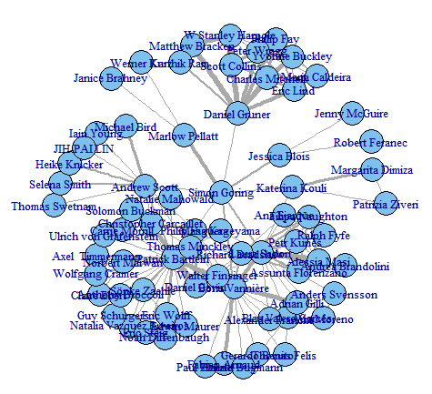

# ORCiD_Network
A quick example using the rORCiD package to build a network of co-authors.

The example isn't all that well commented, but you can build your own network by just replacing the ORCiD I use with your own.

The final output is a figure reflecting the publication/co-authorship network of myself and my co-authors, but only for those co-authors who have ORCiDs.

This code is shared as part of a blog post on [downwithtime](http://downwithtime.wordpress.com) titled: [BUILDING YOUR NETWORK USING ORCID AND ROPENSCI](https://downwithtime.wordpress.com/2015/02/12/building-your-network-using-orcid-and-ropensci/)

